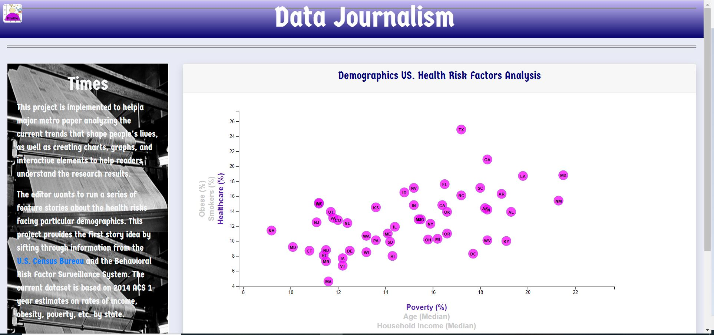

# [Data Journalism](https://janie228.github.io/Journalism_D3/)
### Demographics VS. Health Risk Factors Analysis

-----
## Project Background
Welcome to the newsroom! You've just accepted a data visualization position for a major metro paper. You're tasked with analyzing the current trends shaping people's lives, as well as creating charts, graphs, and interactive elements to help readers understand your findings.

The editor wants to run a series of feature stories about the health risks facing particular demographics. She's counting on you to sniff out the first story idea by sifting through information from the U.S. Census Bureau and the Behavioral Risk Factor Surveillance System.

The data set included with this project is based on [2014 ACS 1-year estimates](https://factfinder.census.gov/faces/nav/jsf/pages/searchresults.xhtml). The current data set includes data on rates of income, obesity, poverty, etc. by state. (MOE stands for "margin of error.")

-----
## Project Solution/Result
* Dynamic Visualization webpage for editor to analyze and identify health risk factors facing particular demographics.
* 

-----
## Technologies Used
Visual Studio Code, HTML/CSS, Bootstrap 4, D3.JS, CSV dataset 

-----
## Installation/Setup
* Clone this repo to your computer
* Run the application in Visual Studio Code

-----
### Copyright
Data Boot Camp © 2018. All Rights Reserved.
